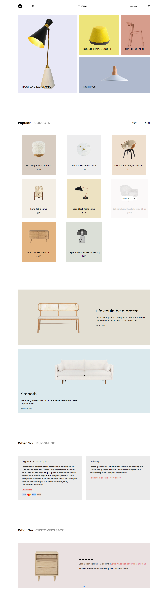

Minim Store

<h2>About the project</h2>

  
A <b>Minim Store</b> is a store website that sells furniture. The website will be built using React, a JavaScript framework that makes it easy to create interactive and dynamic websites. The website will use a data file to store the furniture inventory.

  <ul>
    <li>The website will have a clean and modern design.</li>
    <li>the website will be responsive, meaning it will look good on all devices, including desktops, laptops, tablets, and smartphones.</li>
    <li>The website will use React to create interactive and dynamic features, such as a shopping cart and a checkout process.</li>
    <li>The website will use Vite to make it easy to develop and deploy the application.</li>
    <li>The website will use a data file to store the furniture inventory.</li>
  </ul>

👉 Live Demo: <a href='https://minim-store.vercel.app/' target="_blank">Live Demo</a>

<h3>Build with:</h3>

» React Js 
» Sass

<h2>Screenshots of the Project 📸</h2>
 
<h3 align='center'>Home Page 🏡</h3>

